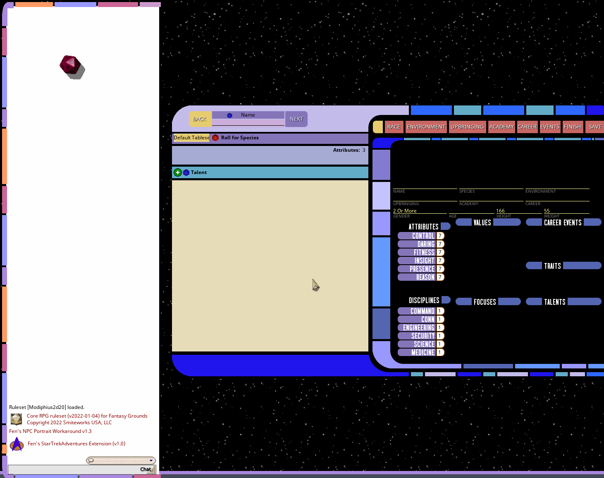
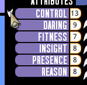

## Lifepath Character Creator

The Star Trek Adventures rulebook includes a set of rules for character creation called "Lifepath" creation. I added a wizard 
to the ruleset to automate the process for users (although there is some [setup](../general/lifepath_tables) required 
first by the GM.

When players connect, they will see this icon in the character selection window:

That will open the wizard for running through lifepath creation:

If no tablesets have been defined by the GM, then it will default to manual mode and you will have to roll the appropriate tables 
yourself and reference the rulebook. 

I had to do it this way because I cannot package content copy/pasted from the Modiphius rule book in this ruleset, since 
that is their IP. But if you have the PDF the process of creating the tables is not super difficult. 

Assuming that the relevant tables have been defined, the mode dropdown should be set to the configured default tableset:

Clicking the blue d20 icon will roll on the relevant table and populate the output:

Each step in the lifepath has various manual steps that also have to be done. The controls below the roll widget are used 
to perform the manual steps. How these work will depend on how much work the GM has done ahead of time to set things up.

These are the types of controls:

###Talent, Value and Focus Widgets

These widgets all work pretty similarly. They each have a manual and random mode. The manual mode is the green + icon, 
and the random mode is the blue d20 icon.

#### Creating Focuses and Values

For focuses and values, clicking the manual button will just open a widget where 
you can input a focus or value, then save it:

#### Selecting or Creating Talents

Clicking a talent in manual mode will open the talent selection window. If the campaign or module records contain talent records 
they will autopopulate this list. **The "Requirements Met" filter will only work if the talents have their requirements set 
correctly** (see: [here](../record_docs/talents_values_and_focuses#talent-requirements)). But the "All Talents" mode will 
display any and all talent records in the campaign or any loaded modules:

Selecting "New Talent" will allow you to just manually enter a talent in a popup and have that added to the character.

#### Random Mode

The random modes only work if there are existing records for it to randomly select from. But if there are, then the random 
button will just set that widget to a randomly chosen focus, value or talent from the campaign or module DBs. If no records 
are found, it will do nothing.

### Attribute and Discipline Widgets

Some steps give you a choice of attributes and/or disciplines, so these widgets will allow you to select those from a list 
as required. The counter in the corner is how many total scores to select:

### Dropdowns

Specifically for the Academy step of lifepath creation, dropdowns are used as that seemed more clear:

### Attribute Reallocation Widget

At the finishing stages tab, if any attributes or values are above the limits as defined in the rulebook, then this little 
down-arrow widget will appear next to the attributes above the limits, to allow you to reallocate those points as required

### Other Notes

In addition to the lifepath tables from the books, I also added sex, height, weight and age generation (age generation 
only takes place after career experience is rolled). 

### Example

Assuming that all required tables and records have been defined by the GM ahead of time, creating characters with the tool 
can be very quick. Here is an example from start to finish (although granted in this case I am just selecting everything at 
random, which is not really how one would typically do it):

This also shows the step alerts above the character summary as steps are completed. Each step will check that the relevant 
selections are made, and that the character's attributes and disciplines are within the limits as specific in the rulebook.
